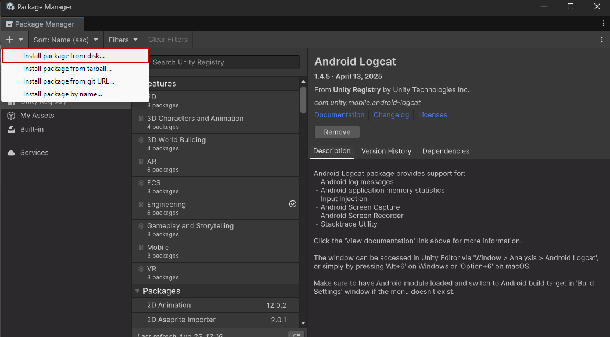

# YOLO Tools

A YOLO toolkit for performing real-time YOLO object-detection in Unity. YOLO Tools can be used as a standalone package
outside of this project. It provides all the functionality used in this project as well as additional 
functions and capabilities for a streamlined YOLO experience in Unity.

## Requirements

- [Unity 6000.0.20f1](https://unity.com/releases/editor/whats-new/6000.0.20#installs)
  - The package also supports Unity 6.2, though this has not been tested as thoroughly. The package is designed to switch to the new InferenceEngine package automatically, though your mileage may vary.
- Horizon OS version 76
- The following permissions are required to use the Object Display Manager:
  - `com.oculus.permission.USE_SCENE`
- The following permissions are required to use the WebCamTextureManager:
  - `horizonos.permission.HEADSET_CAMERA`
  - `android.permission.CAMERA`

## Installation

### Unity Package Manager

#### Installing From Disk

To install using the Unity Package Manager, click the `+` icon in the top left of the package manager and select `Install package from disk...`. Navigate to the YOLOTools folder and
select the [`package.json`](package.json) file. This will automatically install all necessary dependencies from
the Unity registry. All other necessary packages are included within YOLOTools.

#### Installing From Git

Select the `+` icon in the top left of the Package Manager window and select `Install package from git URL...`.
Enter the url of a git repository hosting the package ([feel free to use this one](https://github.com/matthewlyon23/YOLOTools)) and 
click `Install`. If the package is in a subdirectory of the repository, this can be specified with the [`path` query
parameter](https://docs.unity3d.com/6000.2/Documentation/Manual/upm-git.html#subfolder).

### Installing Manually

The package can also be installed manually simply by copying the folder into your project, however the dependencies listed in
[package.json](package.json) will need to be installed manually or the package will not function.

